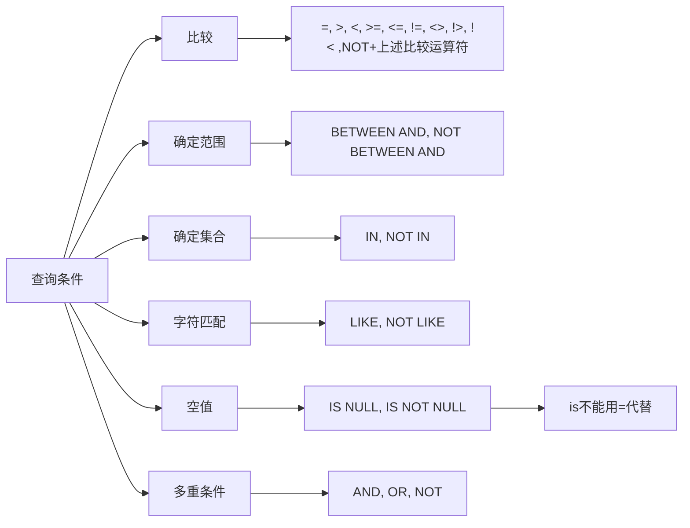

[toc]

# 1.SQL概述

## 1.产生与发展

## 2.特点

集数据定义语言（DDL），数据操纵语言（DML），数据控制语言（DCL）功能于一体。

可以独立完成数据库生命周期中的全部活动：

​	定义和修改、删除关系模式，定义和删除视图，插入数据，建立数据库；
​	对数据库中的数据进行查询和更新；
​	数据库重构和维护；
​	数据库安全性、完整性控制，以及事务控制；
​	嵌入式SQL和动态SQL定义；

用户数据库投入运行后，可根据需要随时逐步修改模式，不影响数据库的运行。

数据结构单一（关系），数据操作符统一（每种操作只有一个操作符）

SQL只需提出“做什么”，无须了解存取路径。存取路径的选择以及SQL的操作过程由系统自动完成。减轻了用户负担，有利于提高数据的独立性。

SQL采用集合操作方式

SQL是独立的语言，能够独立地用于联机交互的使用方式，灵活方便；SQL又是嵌入式语言，SQL能够嵌入到高级语言（例如C，C++，Java）程序中，供程序员设计程序时使用，两种使用方式下，语法结构基本一致。


## 3.基本概念

SQL支持关系数据库三级模式结构

视图--外模式，基本表--模式， 存储文件--内模式

基本表
	本身独立存在的表
	SQL中一个关系就对应一个基本表
	一个（或多个）基本表对应一个存储文件
	一个表可以带若干索引，索引也放在存储文件中

存储文件
	逻辑结构组成了关系数据库的内模式
	物理结构对用户是隐蔽的，物理结构可以任意

视图
	从一个或几个基本表导出的表
	数据库中只存放视图的定义而不存放视图对应的数据
	视图是一个虚表
	用户可以在视图上再定义视图

在用户眼中，视图和基本表都是***关系***，而存储文件对用户是***透明***的。

# 2.学生课程数据库

# 3.数据定义

建立数据库时首先要对数据库中的结构及特征进行描述，该过程成为数据定义。

在SQL语言中，关于数据的描述信息以SQL模式(Schema)的形式组织。每个模式包含0到多个对象，这些对象被称为模式对象，如基表，视图，索引等。

用于模式及模式对象的创建、修改和撤销的语句称为SQL模式语句：create、drop、alter


现代关系数据库管理系统提供了一个层次化的数据库对象命名机制
	一个关系数据库管理系统的实例（Instance）中可以建立多个数据库
	一个数据库中可以建立多个模式（Schema）
	一个模式下通常包括多个表、视图和索引等数据库对象

## 1.模式的定义

CREATE SCHEMA <模式名> AUTHORIZATION <用户名>

要求：执行改命令的用户必须拥有数据库管理员的权限，或者获得了数据库管理员授予的CREATE SCHEMA的权限

*CREATE SCHEMA AUTHORIZATION WANG;该语句没有指定<模式名>，<模式名>隐含为<用户名>*

定义模式实际上定义了一个命名空间。
在这个空间中可以定义该模式包含的数据库对象，例如：基本表、视图、索引等。
在CREATE SCHEMA中可以接受CREATE TABLE，CREATE VIEW和GRANT子句。
CREATE SCHEMA <模式名> AUTHORIZATION <用户名>[<表定义子句>|<视图定义子句>|<授权定义子句>]


## 2.模式的删除

DROP SCHEMA <模式名> <CASCADE|RESTRICT>
CASCADE（级联）
	删除模式的同时把该模式中所有的数据库对象全部删除
RESTRICT（限制）
	如果该模式中定义了下属的数据库对象（如表、视图等），则拒绝该删除语句的执行。
	仅当该模式中没有任何下属的对象时才能执行。

## 3.基本表的定义、删除与修改

### 1.定义基本表

CREATE TABLE<表名>
(<列名><数据类型>[<列级完整性约束条件>]
[,<列名><数据类型>[<列级完整性约束条件>]]
…
[,<表级完整性约束条件>]);
	<表名>：所要定义的基本表的名字
	<列名>：组成该表的各个属性（列）
	<列级完整性约束条件>：涉及相应属性列的完整性约束条件
	<表级完整性约束条件>：涉及一个或多个属性列的完整性约束条件
	*如果完整性约束条件涉及到该表的多个属性列，则必须定义在表级上，否则既可以定义在列级也可以定义在表级。*


语法：
CREATE TABLE 表名(
列名数据类型[DEFAULT缺省值] [NOT NULL]
[, 列名数据类型[DEFAULT缺省值] [NOT NULL]]
……
[, PRIMARY KEY(列名[, 列名] …)]
[, FOREIGN KEY (列名[, 列名] …)
REFERENCES表名(列名[, 列名] …)]
[，CHECK(条件表达式)] );


SQL中域的概念用数据类型来实现，定义表的属性时需要指明其数据类型及长度，选用哪种数据类型，取值范围，要做哪些运算


每一个基本表都属于某一个模式，一个模式包含多个基本表

定义基本表所属模式
	方法一：在表名中明显地给出模式名
		Create table"S-T".Student(......); /*模式名为S-T*/
		Create table "S-T".Cource(......);
		Create table "S-T".SC(......);
	方法二：在创建模式语句中同时创建表
	方法三：设置所属的模式


创建基本表（其他数据库对象也一样）时，若没有指定模式，系统根据搜索路径来确定该对象所属的模式
关系数据库管理系统会使用模式列表中第一个存在的模式作为数据库对象的模式名
若搜索路径中的模式名都不存在，系统将给出错误
显示当前的搜索路径：SHOW search_path;
搜索路径的当前默认值是：$user，PUBLIC

数据库管理员用户可以设置搜索路径，然后定义基本表

### 2.修改基本表

ALTER TABLE <表名>
[ ADD[COLUMN] <新列名> <数据类型> [ 完整性约束] ]
[ ADD <表级完整性约束>]
[ DROP [ COLUMN ] <列名> [CASCADE| RESTRICT] ]
[ DROP CONSTRAINT<完整性约束名>[ RESTRICT | CASCADE ]]
[ALTER COLUMN <列名><数据类型>] ;

不管基本表中原来是否已有数据，新增加的列一律为空值

### 3.删除基本表

DROP TABLE <表名>［RESTRICT| CASCADE］;

RESTRICT：删除表是有限制的。
	欲删除的基本表不能被其他表的约束所引用，不能有视图、触发器、存储过程、函数等。
	如果存在依赖该表的对象，则此表不能被删除
CASCADE：删除该表没有限制。
	在删除基本表的同时，相关的依赖对象一起删除


## 4.索引的建立与删除

### 1.建立索引


CREATE [UNIQUE] [CLUSTER] INDEX<索引名>
ON<表名>(<列名>[<次序>][,<列名>[<次序>]][,<列名>[<次序>]]…);
	<表名>：要建索引的基本表的名字
	索引：可以建立在该表的一列或多列上，各列名之间用逗号分隔
	<次序>：指定索引值的排列次序，升序：ASC，降序：DESC。缺省值：ASC
	UNIQUE：此索引的每一个索引值只对应唯一的数据记录
	CLUSTER：表示要建立的索引是聚簇索引

CLUSTER (聚簇索引)：索引项的顺序与表中记录的物理顺序一致。表中如果有多个记录在索引字段上相同，这些记录构成一簇，只有一个索引值。在最经常查询的列上建立聚簇索引以提高查询效率；经常更新的列不宜建立聚簇索引。
优点：查询速度快。
缺点：维护成本高，且一个表只能建一个聚簇索引

建立索引的原则：
	主键列上一定要建立索引。
	外键列可以建索引。
	在经常查询的字段上最好建立索引：
		常作为连接属性
		常出现在查询条件中
	对于那些查询中很少涉及的列、重复值比较多的列不要建索引
	对于定义为text，image和bit数据类型的列上不要建立索引

### 2.修改索引

ALTER INDEX <旧索引名> RENAME TO <新索引名>

### 3.删除索引

DROP INDEX<索引名>;
删除索引时，系统会从数据字典中删去有关该索引的描述。

### 4.索引说明

索引可以动态地定义，即可以随时建立和删除索引；
不允许用户在数据操作中引用索引；
索引如何使用完全由系统自动决定，这支持了数据的物理独立性；
索引的建立要适当：
		应该在使用频率高的、经常用于连接的列上建索引
		索引可以提高查询效率，但过多或不当的索引会耗费空间，且降低插入、删除、更新的效率。

## 5.数据字典

数据字典是关系数据库管理系统内部的一组系统表，它记录了数据库中所有定义信息：
		关系模式定义
		视图定义
		索引定义
		完整性约束定义
		各类用户对数据库的操作权限
		统计信息等
关系数据库管理系统在执行SQL的数据定义语句时，实际上就是在更新数据字典表中的相应信息。

# 4.数据查询

SELECT[ALL|DISTINCT]<目标列表达式>[,<目标列表达式>]…
FROM<表名或视图名>[,<表名或视图名>]…|(SELECT语句)
[AS]<别名>
[WHERE<条件表达式>]
[GROUP BY<列名1>[HAVING<条件表达式>]]
[ORDER BY<列名2>[ASC|DESC]];
*WHERE子句称为行条件子句；
GROUP子句称为分组子句；
HAVING子句称为组条件子句；
ORDER子句称为排序子句。*


SELECT子句：指定要显示的属性列
FROM子句：指定查询对象（基本表或视图）
WHERE子句：指定查询条件
GROUPBY子句：对查询结果按指定列的值分组，该属性列值相等的元组为一个组。通常会在每组中作用聚集函数。
HAVING短语：只有满足指定条件的组才予以输出
ORDER BY子句：对查询结果表按指定列值的升序或降序排序

### 1.单表查询

#### 选择若干列

查询指定列
查询全部列
		在SELECT关键字后面列出所有列名
		将<目标列表达式>指定为*

查询经过计算的值

​		SELECT子句的<目标列表达式>不仅可以为表中的属性列，也可以是表达式

使用列别名改变查询结果的列标题，例如

​		SELECT Sname NAME,'Year of Birth:' BIRTH,2014-Sage BIRTHDAY,LOWER(Sdept) DEPARTMENT
​		FROM Student;

#### 选择若干元组

消除取值重复的行
		如果没有指定DISTINCT关键词，则缺省为ALL

​		指定DISTINCT关键词，去掉表中重复的行



字符匹配

​		谓词：[NOT]LIKE‘<匹配串>’[ESCAPE‘<换码字符>’]
​		<匹配串>可以是一个完整的字符串，也可以含有通配符%和_
​		%（百分号）代表任意长度（长度可以为0）的字符串
​				例如a%b表示以a开头，以b结尾的任意长度的字符串
​		_（下横线）代表任意单个字符。
​				例如a_b表示以a开头，以b结尾的长度为3的任意字符串

​		使用换码字符将通配符转义为普通字符
​				[例3.34] 查询DB_Design课程的课程号和学分。
​				SELECT Cno，Ccredit
​				FROM Course
​				WHERE Cname LIKE 'DB\_Design' ESCAPE '\' ;
​				[例3.35] 查询以"DB_"开头，且倒数第3个字符为i的课程的详细情况。
​				SELECT *
​				FROM Course
​				WHERE Cname LIKE 'DB\_%i_ _'ESCAPE '\' ;
​				ESCAPE '＼' 表示“＼”为换码字符

#### order by子句

可以按一个或多个属性列排序
升序：ASC;降序：DESC;缺省值为升序
对于空值，排序时显示的次序由具体系统实现来决定

#### 聚集函数

聚集函数：***只能用在select和having子句***，当聚集函数遇到NULL时，除COUNT(\*)，都跳过空值而只处理非空值
统计元组个数
		COUNT([DISTINCT|ALL]*)
统计一列中值的个数
		COUNT([DISTINCT|ALL]<列名>)
计算一列值的总和（此列必须为数值型）
		SUM([DISTINCT|ALL]<列名>)
计算一列值的平均值（此列必须为数值型）
		AVG([DISTINCT|ALL]<列名>)
求一列中的最大值和最小值
		MAX([DISTINCT|ALL]<列名>)
		MIN([DISTINCT|ALL]<列名>)

#### group by子句

GROUPBY子句分组：
细化聚集函数的作用对象
		如果未对查询结果分组，聚集函数将作用于整个查询结果
		对查询结果分组后，聚集函数将分别作用于每个组
		按指定的一列或多列值分组，值相等的为一组
		HAVING子句可以对分组后的结果作进一步的筛选

***HAVING短语与WHERE子句的区别：***
作用对象不同
WHERE子句作用于基表或视图，从中选择满足条件的元组
HAVING短语作用于组，从中选择满足条件的组。

***分组查询的SELECT目标列中只允许出现聚集函数和GROUP BY子句中出现过的列***

解释如下：

[分组查询的SELECT目标列中只允许出现聚集函数和GROUP BY子句中出现过的列，是指在使用GROUP BY子句对数据进行分组时，SELECT子句中的列必须是分组的依据或者是对分组后的数据进行统计的函数。这样做的目的是保证每个分组只返回一行结果，而不会出现不确定的数据。](https://www.zhihu.com/question/383421033)[1](https://www.zhihu.com/question/383421033)[2](https://blog.csdn.net/wpc2018/article/details/122925224)

例如，如果要查询每个部门的平均工资，可以这样写：

```sql
SELECT dept_name, AVG(salary) AS avg_salary
FROM instructor
GROUP BY dept_name;
```

这里，SELECT子句中的列`dept_name`是GROUP BY子句中出现过的列，表示按照部门名称进行分组；`AVG(salary)`是一个聚集函数，表示计算每个分组的平均工资。这样，每个部门只会返回一行结果，显示部门名称和平均工资。

[如果在SELECT子句中添加一个没有出现在GROUP BY子句中的列，比如`id`，就会出现错误，因为每个部门可能有多个教师，而每个教师的`id`不同，所以无法确定返回哪个`id`。](https://www.zhihu.com/question/383421033)[3](https://bing.com/search?q=分组查询的SELECT目标列中只允许出现聚集函数和GROUP+BY子句中出现过的列是什么意思)

```sql
-- 错误的查询
SELECT dept_name, id, AVG(salary) AS avg_salary
FROM instructor
GROUP BY dept_name;
```

[如果想要查询每个部门每个职位的平均工资，可以使用并列分组，即在GROUP BY子句中添加多个列，表示按照这些列的组合进行分组。这时，SELECT子句中的列也必须是这些列或者聚集函数。](https://www.zhihu.com/question/383421033)[4](https://www.cnblogs.com/xiao19971225/p/16137014.html)

```sql
SELECT dept_name, job, AVG(salary) AS avg_salary
FROM instructor
GROUP BY dept_name, job;
```

这里，SELECT子句中的列`dept_name`和`job`都是GROUP BY子句中出现过的列，表示按照部门名称和职位进行分组；`AVG(salary)`是一个聚集函数，表示计算每个分组的平均工资。这样，每个部门每个职位的组合只会返回一行结果，显示部门名称、职位和平均工资。

### 2.连接查询

连接查询：同时涉及两个以上的表的查询
连接条件或连接谓词：用来连接两个表的条件
一般格式：
[<表名1>.]<列名1> <比较运算符>[<表名2>.]<列名2>
[<表名1>.]<列名1> BETWEEN[<表名2>.]<列名2> AND[<表名2>.]<列名3>
连接字段：连接谓词中的列名称
连接条件中的各连接字段类型必须是可比的，但名字不必相同

#### 1.等值与非等值连接查询

等值连接：连接运算符为=

连接操作的执行过程：

​		嵌套循环法（NESTED-LOOP）

​		排序合并法（SORT-MERGE）

​		索引连接（INDEX-JOIN）

还可用自然连接：

​		SELECT Student.sno, Sname
​		FROM SC
​		INNER JOIN Student on Student.Sno = SC.Cno
​		WHERE SC.Cno = ‘2’ AND
​		SC.Grade > 90;

#### 2.自身连接

自身连接：一个表与其自己进行连接
		需要给表起别名以示区别
		由于所有属性名都是同名属性，因此必须使用别名前缀

[例3.52]查询每一门课的间接先修课（即先修课的先修课）
		SELECT FIRST.Cno, SECOND.Cpno
		FROM Course FIRST, Course SECOND
		WHERE FIRST.Cpno= SECOND.Cno;

#### 3.外连接

外连接与普通连接的区别
		普通连接操作只输出满足连接条件的元组
		外连接操作以指定表为连接主体，将主体表中不满足连接条件的元组一并输出FULL [OUTER] JOIN
		左外连接LEFT[OUTER]JOIN
		列出左边关系中所有的元组
		右外连接RIGHT[OUTER]JOIN
		列出右边关系中所有的元组

#### 4.多表连接

### 3.嵌套查询

嵌套查询概述
一个SELECT-FROM-WHERE语句称为一个查询块
将一个查询块嵌套在另一个查询块的WHERE子句或HAVING短语的条件中的查询称为嵌套查询

上层的查询块称为外层查询或父查询
下层查询块称为内层查询或子查询
SQL语言允许多层嵌套查询
即一个子查询中还可以嵌套其他子查询

**子查询的限制**
		不能使用ORDER BY子句, ORDER BY子句只能对最终结果进行排序


不相关子查询：子查询的查询条件不依赖于父查询
		由里向外逐层处理。即每个子查询在上一级查询处理之前求解，子查询的结果用于建立其父查询的查找条件。

相关子查询：子查询的查询条件依赖于父查询
		首先取外层查询中表的第一个元组，根据它与内层查询相关的属性值处理内层查询，若WHERE子句返回值为真，则取此元组放入结果表
		然后再取外层表的下一个元组
		重复这一过程，直至外层表全部检查完为止


EXISTS谓词
		代表存在量词∃
		带有EXISTS谓词的子查询不返回任何数据，只产生逻辑真值“true”或逻辑假值“false”。
		若内层查询结果非空，则外层的WHERE子句返回真值
		若内层查询结果为空，则外层的WHERE子句返回假值
		由EXISTS引出的子查询，其目标列表达式通常都用* ，因为带EXISTS的子查询只返回真值或假值，给出列名无实际意义。

NOT EXISTS谓词
		若内层查询结果非空，则外层的WHERE子句返回假值
		若内层查询结果为空，则外层的WHERE子句返回真值

不同形式的查询间的替换
		一些带EXISTS或NOT EXISTS谓词的子查询不能被其他形式的子查询等价替换
		所有带IN谓词、比较运算符、ANY和ALL谓词的子查询都能用带EXISTS谓词的子查询等价替换
用EXISTS/NOT EXISTS实现全称量词（难点）
SQL语言中没有全称量词∀（For all），可以把带有全称量词的谓词转换为等价的带有存在量词的谓词：(∀x) P ≡ ¬( ∃x ( ¬P ))

用EXISTS/NOT EXISTS实现逻辑蕴涵（难点）
		SQL语言中没有蕴涵（Implication）逻辑运算，但总可以利用谓词演算将逻辑蕴涵谓词等价转换为：p →q ≡ ¬p∨q

### 4.集合查询

集合操作的种类
		并操作UNION
		交操作INTERSECT
		差操作EXCEPT
参加集合操作的各查询结果的列数必须相同；对应项的数据类型也必须相同

UNION：将多个查询结果合并起来时，系统自动去掉重复元组
UNION ALL：将多个查询结果合并起来时，保留重复元组

### 5.基于派生表的查询

子查询不仅可以出现在WHERE子句中，还可以出现在FROM子句中，这时子查询生成的临时派生表（Derived Table）成为主查询的查询对象

**如果子查询中没有聚集函数，派生表可以不指定属性列，子查询SELECT子句后面的列名为其缺省属性。**

这句话的意思是，如果您在FROM子句中使用子查询来生成一个临时的派生表，而子查询中没有使用聚集函数（如SUM，AVG，COUNT等），那么您可以不用给派生表的每一列指定一个别名，而是直接使用子查询中SELECT子句后面的列名作为派生表的列名。这样可以简化您的SQL语句，也可以避免重复命名。

举个例子，假设您有一个学生表（Student）和一个选课表（SC），您想要查询所有选修了1号课程的学生姓名，您可以使用以下SQL语句：

```sql
SELECT Sname
FROM Student, (SELECT Sno FROM SC WHERE Cno='1') AS SC1
WHERE Student.Sno = SC1.Sno;
```

这里，您在FROM子句中使用了一个子查询，来生成一个派生表SC1，而子查询中没有使用聚集函数，所以您可以不用给派生表的列指定别名，而是直接使用子查询中的列名Sno作为派生表的列名。这样，您就可以在WHERE子句中使用Student.Sno = SC1.Sno来连接两个表，从而得到您想要的结果。

再看另一个例子就能看出差别

```mysql
SELECT Sno, Cno
FROM SC, (SELECT Sno, Avg(Grade)
			FROM SC
			GROUP BY Sno)
			AS Avg_sc(avg_sno,avg_grade)
WHERE SC.Sno = Avg_sc.avg_sno
AND SC.Grade >=Avg_sc.avg_grade
```

### 6.select语句一般形式

参上即可

# 5.数据更新
## 1.插入数据
两种插入数据方式
		插入元组
		插入子查询结果
			可以一次插入多个元组

**插入元组**

语句格式
		INSERT
		INTO <表名> [(<属性列1>[,<属性列2 >…)]
		VALUES (<常量1> [,<常量2>]… );
功能
		将新元组插入指定表中

INTO子句
		指定要插入数据的表名及属性列
		属性列的顺序可与表定义中的顺序不一致
		没有指定属性列：表示要插入的是一条完整的元组，且属性列属性与表定义中的顺序一致
		指定部分属性列：插入的元组在其余属性列上取空值

VALUES子句
		提供的值必须与INTO子句匹配
				值的个数
				值的类型

**插入子查询结构**

语句格式
		INSERT
		INTO <表名> [(<属性列1> [,<属性列2>… )]
		子查询;

INTO子句
		子查询
		SELECT子句目标列必须与INTO子句匹配
				值的个数
				值的类型

关系数据库管理系统在执行插入语句时会检查所插元组是否破坏表上已定义的完整性规则
		实体完整性
		参照完整性
		用户定义的完整性
				NOT NULL约束
				UNIQUE约束
				值域约束

## 2.修改数据
语句格式
UPDATE <表名>
SET <列名>=<表达式>[,<列名>=<表达式>]…
[WHERE <条件>];

功能
		修改指定表中满足WHERE子句条件的元组
		SET子句给出<表达式>的值用于取代相应的属性列
		如果省略WHERE子句，表示要修改表中的所有元组

三种修改方式
		修改某一个元组的值
		修改多个元组的值
		带子查询的修改语句

关系数据库管理系统在执行修改语句时会检查修改操作是否破坏表上已定义的完整性规则
实体完整性
主码不允许修改
用户定义的完整性
		NOT NULL约束
		UNIQUE约束
		值域约束
		

## 3.删除数据
语句格式
DELETE
FROM<表名>
[WHERE<条件>];
功能
		删除指定表中满足WHERE子句条件的元组
WHERE子句
		指定要删除的元组
		缺省表示要删除表中的全部元组，表的定义仍在字典中

三种删除方式
		删除某一个元组的值
		删除多个元组的值
		带子查询的删除语句

# 6.空值处理

空值就是“不知道”或“不存在”或“无意义”的值。
一般有以下几种情况：
		该属性应该有一个值，但目前不知道它的具体值
		该属性不应该有值
		由于某种原因不便于填写

**空值是一个很特殊的值，含有不确定性。对关系运算带来特殊的问题，需要做特殊的处理。**

判断一个属性的值是否为空值，用IS NULL或IS NOT NULL来表示。

属性定义（或者域定义）中
		有NOT NULL约束条件的不能取空值
		加了UNIQUE限制的属性不能取空值
		码属性不能取空值

空值与另一个值（包括另一个空值）的**算术**运算的结果为空值
空值与另一个值（包括另一个空值）的**比较**运算的结果为UNKNOWN。
有UNKNOWN后，传统二值（TRUE，FALSE）逻辑就扩展成了三值逻辑
# 7.视图
视图的特点
		虚表，是从一个或几个基本表（或视图）导出的表
		只存放视图的定义，不存放视图对应的数据
		基表中的数据发生变化，从视图中查询出的数据也随之改变

## 1.定义视图
语句格式
CREATE VIEW
<视图名> [(<列名> [,<列名>]…)]
AS<子查询>
[WITH CHECK OPTION];

子查询可以是任意的SELECT语句，是否可以含有ORDER BY子句和DISTINCT短语，则决定具体系统的实现。

WITH CHECK OPTION
		对视图进行UPDATE，INSERT和DELETE操作时要保证更新、插入或删除的行满足视图定义中的谓词条件（即子查询中的条件表达式）
		
组成视图的属性列名：全部省略或全部指定
全部省略:
		由子查询中SELECT目标列中的诸字段组成
明确指定视图的所有列名:
		某个目标列是聚集函数或列表达式
		多表连接时选出了几个同名列作为视图的字段
		需要在视图中为某个列启用新的更合适的名字
		
关系数据库管理系统执行CREATE VIEW语句时只是把视图定义存入数据字典，并不执行其中的SELECT语句。

在对视图查询时，按视图的定义从基本表中将数据查出。

若一个视图是从单个基本表导出的，并且只是去掉了基本表的某些行和某些列，但保留了主码，我们称这类视图为**行列子集视图**。
## 2.删除视图
语句的格式：
DROP VIEW <视图名>[CASCADE];
		该语句从数据字典中删除指定的视图定义
		如果该视图上还导出了其他视图，使用CASCADE级联删除语句，把该视图和由它导出的所有视图一起删除
		删除基表时，由该基表导出的所有视图定义都必须显式地使用DROP VIEW语句删除
## 3.查询视图
用户角度：查询视图与查询基本表相同
关系数据库管理系统实现视图查询的方法
		视图消解法（View Resolution）
				进行有效性检查
				转换成等价的对基本表的查询
				执行修正后的查询

视图消解法的局限
		有些情况下，视图消解法不能生成正确的查询。
## 4.更新视图
更新视图的限制：一些视图是不可更新的，因为对这些视图的更新不能唯一地有意义地转换成对相应基本表的更新

允许对行列子集视图进行更新
对其他类型视图的更新不同系统有不同规定
## 5.视图的作用

视图能够简化用户的操作
视图使用户能以多种角度看待同一数据
视图对重构数据库提供了一定程度的逻辑独立性
视图能够对机密数据提供安全保护
适当的利用视图可以更清晰的表达查询
