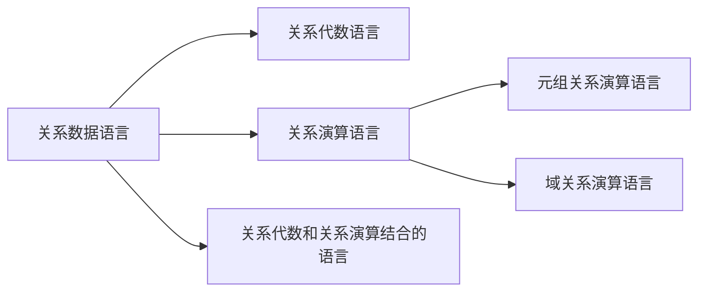

[toc]

# 关系模型三要素

## 1.关系数据结构

### 1.单一的数据结构：关系

现实世界的实体以及实体间的各种联系均用关系来表示

### 2.数据的逻辑结构：二维表

从用户角度，关系模型中数据的逻辑结构是一张二维表

## 2.关系操作集合

### 1.常用关系操作

查询：选择，投影（可能会去除重复行），连接，除，并，交，差

数据更新：插入，删除，修改

### 2.关系操作的特点

集合操作方式：操作的对象和结果都是集合

### 3.关系数据语言的种类

### 1.关系代数语言

用对关系的运算来表达查询要求

### 2.关系演算语言

用谓词来表达查询要求

​	元组关系演算语言：谓词变元基本对象是元组变量

​	域关系演算语言：基本对象是域变量

### 3.兼顾双重特点

### 4.关系数据语言的特点

高度过程化

能够嵌入高级语言

三种语言的表达能力完全等价

## 3.关系的三类完整性约束

### 1.实体完整性

主属性不能取空值

主码中的属性值不能为空值

主码不能相同

### 2.参照完整性

1.关系间引用（关系自身引用，比如学生关系的班长属性）

2.外码

​	**设F是基本关系R的一个或一组属性，但不是关系R的码。如果F与基本关系S的主码Ks相对应，则称F是R的外码**

​	R称为参照关系，S称为被参照关系

3.参照完整性规则

对于R中每个元组在F上的值必须为：

​	或者取空值

​	或者等于S中某个元组的主码值

### 3.用户定义完整性

实现方式：

DBMS提供接口，用户负责定义完整性约束；

DBMS提供完整性约束的自动检查

# 关系数据结构及形式化定义

## 1.关系

### 1.域

一组具有相同数据类型的值的集合

域的基数

关系中用域表示属性的取值范围

### 2.笛卡尔积

元组：笛卡尔积中每一个元素

分量：元素的每一个值d

基数：所有组合的可能性数量

笛卡尔积可以表示为一张二维表，表中的每行对应一个元组，表中的每列对应一个域

笛卡尔积不一定有意义

### 3.关系

笛卡尔积的子集

关系中属性的数量称为**目**或**度**，关系中不同列可以对应相同的域，为了加以区分，必须对每个列起一个名字，称为属性，n目关系必有n个属性

**候选码：若关系中的某一属性组能唯一地标识一个元组，而其子集不能表示，则称该属性组称为候选码**

全码：所有属性组都是候选码

主码：候选码里选出一个作为主码

候选码的诸属性称为主属性，不包含在候选码中则称为非主属性

三类关系：基本关系（实际存在）、查询表（查询结果）、视图表（导出视图）

列是同质的，同一列来自相同的域

不同的列可出自同一个域

行列次序可以随意交换

## 2.关系模式

关系模式是对关系的描述

​	元组集合的结构：构成属性，属性的域，属性与域之间的对应关系

​	完整性约束条件

关系模式形式化表示：R(U,D,DOM,F)，通常简记为R(U)

R关系名，U属性名集合，D域集合，DOM对应关系集合，F依赖关系集合

#### 关系模式和关系的区别

关系模式是对关系的描述，静态稳定

关系是关系模式在某一时刻的状态或内容，动态随时间变化

## 3.关系数据库

所有**关系的集合**

型：关系数据库模式，是对关系数据库的描述

值：某一时刻对应的关系的集合

## 4.关系模型的存储结构

# 关系操作

内容参上，补充：

sql包括查询、数据定义语言、数据操纵语言、数据控制语言（授权等）

sql与存储路径无关

sql可进行查询优化

# 关系完整性

参上

# 关系代数

运算三要素：运算对象，运算符，运算结果

### 传统的集合运算

参上，补充：

是二目运算，除笛卡尔积外要求参加运算的关系必须具备相容性

若两个关系具有相同的度，并且对应属性来自同一个域，说明关系相容

笛卡尔积将两个关系无条件的连接成一个新关系，可用于两关系的连接操作

### 专门的集合运算

参上，补充：

先认符号：

R，t∈R，t[Ai]
设关系模式为R(A1，A2，…，An)
它的一个关系设为R
t∈R表示t是R的一个元组
t[Ai]则表示元组t中相应于属性Ai的一个分量

A，t[A]，A一把
若A={Ai1，Ai2，…，Aik}，其中Ai1，Ai2，…，Aik是A1，A2，…，An中的一部分，则A称为属性列或属性组。
t[A]=(t[Ai1]，t[Ai2]，…，t[Aik])表示元组t在属性列A上诸分量的集合。
A一把则表示{A1，A2，…，An}中去掉{Ai1，Ai2，…，Aik}后剩余的属性组。

tr弧ts
R为n目关系，S为m目关系。
tr ∈R，ts∈S，tr弧ts称为元组的连接或串接。
tr弧ts是一个n+ m列的元组，前n个分量为R中的一个n元组，后m个分量为S中的一个m元组。
若tr= (r1，…，rn)，ts= (s1 ，… ，sm)，则
tr弧ts= (r1，…，rn，s1 ，… ，sm)

象集Zx
给定一个关系R（X，Z），X和Z为属性组。
当t[X]=x时，x在R中的象集（ImagesSet）为：
Zx={t[Z]|t∈R，t[X]=x}
它表示R中属性组X上值为x的诸元组在Z上分量的集合

**重点强调连接：**

连接也称为θ连接
连接运算的含义：从两个关系的笛卡尔积中选取属性间满足一定条件的元组
R连接S（AθB）={|tr∈R∧ts∈S∧tr[A]θts[B]}
	A和B：分别为R和S上度数相等且可比的属性组
	θ：比较运算符
	连接运算从R和S的广义笛卡尔积R×S中选取R关系在A属性组上的值与S关系在B属性组上的值满足比较关系θ的元组
步骤：1）做笛卡儿积，2）选择

常见连接：等值连接，自然连接

自然连接是一种特殊的等值连接，两个关系中进行比较的分量必须是相同的属性组，在结果中把重复的属性列去掉

悬浮元组：两个关系R和S在做自然连接时被舍弃的那些元组

解决方法：把悬浮元组保存在结果关系中，而在其他属性上填空值，就叫做外连接。

外连接，左外连接（保留左边），右外连接（保留右边）

注意，这一章有关系代数的大量例题，一定要认真做一遍！
