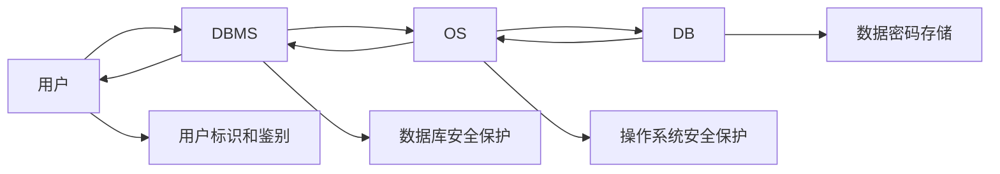

[toc]

数据库的安全性是指保护数据库以防止不合法使用所造成的数据泄露、更改或破坏。
系统安全保护措施是否有效是数据库系统主要的性能指标之一。

# 1.数据库安全性概述

## 1.数据库的不安全因素

1. 非授权用户对数据库的恶意存取和破坏
		数据库管理系统提供的安全措施主要包括用户身份认证、访问控制和视图等技术。
2. 数据库中重要或敏感的数据被泄露

  	数据库管理系统提供的主要技术有强制访问控制、数据加密存储和传输加密等。
  	审计：分析审计日志
3. 安全环境的脆弱性
    数据库的安全性与计算机系统的安全性紧密联系

  		计算机硬件、操作系统、网络系统等的安全性
  		建立一套可信（Trusted）计算机系统的概念和标准

计算机系统安全性：
		为计算机系统建立和采取的各种安全保护措施，以保护计算机系统中的硬件、软件及数
据，防止其因偶然或恶意的原因使系统遭到破坏，数据遭到更改或泄露等。
		范畴：硬件、软件、数据

## 2.安全标准简介

目前CC已基本取代了TCSEC，成为评估信息产品安全性的主要标准。

TCSEC/TDI标准的基本内容
		TCSEC/TDI，从四个方面来描述安全性级别划分的指标
				安全策略
				责任
				保证
				文档

| 安全级别 | 定义                                              | 能力                                                         | CC评估保证级 | 定义                                                         |
| -------- | ------------------------------------------------- | ------------------------------------------------------------ | ------------ | ------------------------------------------------------------ |
| A1       | 验证设计（Verified Design）                       | 验证设计，即提供B3级保护的同时给出系统的形式化设计说明和验证以确信各安全保护真正实现 | EAL7         | 形式化验证的设计和测试（formally verified design and tested） |
| B3       | 安全域（Security Domains）                        | 安全域，该级的TCB必须满足访问监控器( 监控主体和客体之间授权访问关系的部件)的要求，审计跟踪能力更强，并提供系统恢复过程 | EAL6         | 半形式化验证的设计和测试（semi-formally verified design and tested） |
| B2       | 结构化保护（Structural Protection）               | 结构化保护，建立形式化的安全策略模型并对系统内的所有主体和客体实施DAC和MAC | EAL5         | 半形式化设计和测试（semi-formally designed and tested）      |
| B1       | 标记安全保护（Labeled Security Protection）       | 标记安全保护。“安全”（Security）或“可信的”（Trusted）产品。对系统的数据加以标记，对标记的主体(用户，进程)和客体(表，视图，索引…)实施强制访问控制（MAC）、审计等安全机制 | EAL4         | 系统地设计、测试和复查（methodically designed，tested， and reviewed） |
| C2       | 受控的访问保护（Controlled Access Protection）    | 安全产品的最低档次，提供受控的访问保护，将C1级的DAC进一步细化，以个人身份注册，并实施审计和资源隔离 | EAL3         | 系统地测试和检查（methodically tested and checked）          |
| C1       | 自主安全保护（Discretionary Security Protection） | 非常初级的自主安全保护，能够实现对用户和数据的分离，进行自主访问控制（DAC），保护或限制用户权限的传播，现有的商业系统稍作改进即可满足 | EAL2         | 结构测试（structurally tested）                              |
| D        | 最小保护（Minimal Protection）                    | 将一切不符合更高标准的系统均归于D组                          | EAL1         | 功能测试（functionally tested）                              |

按系统可靠或可信程度逐渐增高
各安全级别之间具有一种偏序向下兼容的关系，即较高安全性级别提供的安全保护要包含较低级别的所有保护要求，同时提供更多或更完善的保护能力

CC

提出国际公认的表述信息技术安全性的结构
把信息产品的安全要求分为
安全功能要求
安全保证要求

# 2.数据库安全性机制

非法使用数据库的情况
		编写合法程序绕过数据库管理系统及其授权机制
		直接或编写应用程序执行非授权操作
		通过多次合法查询数据库从中推导出一些保密数据
破坏安全性的行为可能是无意的、故意的、恶意的。

计算机系统中，安全措施是一级一级层层设置

系统根据用户标识鉴定用户身份，合法用户才准许进入计算机系统
数据库管理系统还要进行访问控制，只允许用户执行合法操作
操作系统有自己的保护措施
数据以加密形式存储到数据库中

存取控制流程
		首先，数据库管理系统对提出SQL访问请求的数据库用户进行身份认证，防止不可信用户使用系统。
		然后，在SQL处理层进行自主访问控制和强制访问控制，进一步可以进行推理控制。
		还可以对用户访问行为和系统关键操作进行审计，对异常用户行为进行简单入侵检测。

数据库安全性控制的常用方法
		用户标识和认证
		访问控制
		视图
		审计
		数据加密

## 1.用户身份认证

用户身份认证
		系统提供的最外层安全保护措施
		用户标识：由用户名（user name）和用户标识号UID组成
		（用户标识号UID在系统整个生命周期内唯一）

用户身份认证的方法
1. 静态口令认证
静态口令一般由用户自己设定，这些口令是静态不变的
（易破解）
2. 动态口令认证
口令是动态变化的，每次认证时均需使用动态产生的新口
令登录数据库管理系统，即采用一次一密的方法，短信
3. 生物特征认证
通过生物特征进行认证的技术，生物特征如指纹、虹膜和
掌纹等
4. 智能卡认证
智能卡是一种不可复制的硬件，内置集成电路的芯片，具
有硬件加密功能。PIN+智能卡

## 2.访问控制

访问控制机制组成
		定义用户权限，并将用户权限登记到数据字典中
				用户对某一数据对象的操作权力称为权限
				DBMS提供适当的语言来定义用户权限，存放在数据字典中，称做安全规则或授权规则

​		合法权限检查
​				用户发出存取数据库操作请求
​				DBMS查找数据字典，进行合法权限检查
用户权限定义和合法权限检查机制一起组成了数据库管理系统的访问控制子系统

**常用访问控制方法**
自主访问控制（Discretionary Access Control ，简称DAC）
		C2级
		用户对不同的数据对象有不同的访问权限
		不同的用户对同一对象也有不同的权限
		用户还可将其拥有的存取权限转授给其他用户

强制访问控制（Mandatory Access Control，简称MAC）
		B1级
		每一个数据对象被标以一定的密级(classification)
		每一个用户也被授予某一个级别的许可证(clearance)
		对于任意一个对象，只有具有合法许可证的用户才可以访问

## 3.自主访问控制方法

通过SQL 的GRANT 语句和REVOKE 语句实现

用户权限组成
		数据对象
		操作类型

定义用户访问权限：定义用户可以在哪些数据库对象上进行哪些类型的操作

定义访问权限称为授权

## 4.授权

1.GRANT
GRANT语句的一般格式：
GRANT <权限>[,<权限>]...
ON <对象类型> <对象名>[,<对象类型> <对象名>]…
TO <用户>[,<用户>]...
[WITH GRANT OPTION];

语义：将对指定操作对象的指定操作权限授予指定的用户

发出GRANT：
		数据库管理员
		数据库对象创建者（即属主Owner）
		拥有该权限的用户
按受权限的用户
		一个或多个具体用户
		PUBLIC（即全体用户）

WITH GRANT OPTION子句:
		指定：可以再授予
		没有指定：不能传播

不允许循环授权

对属性列的授权时必须明确指出相应属性列名

2.REVOKE
授予的权限可以由数据库管理员或其他授权者用REVOKE语句收回
REVOKE语句的一般格式为：
REVOKE <权限>[,<权限>]...
ON <对象类型> <对象名>[,<对象类型><对象名>]…
FROM <用户>[,<用户>]...[CASCADE | RESTRICT];

将用户U5的INSERT权限收回的时候应该使用CASCADE，否则拒绝执行该语句
如果U6或U7还从其他用户处获得对SC表的INSERT权限，则他们仍具有此权限，系统只收回直接或间接从U5处获得的权限

3.创建数据库模式的权限
数据库管理员在创建用户时实现
CREATE USER语句格式
CREATE USER <username> [WITH] [DBA|RESOURCE|CONNECT];

​		只有系统的超级用户才有权创建一个新的数据库用户新创建的数据库用户有三种权限：CONNECT、RESOURCE和DBA
​		如没有指定创建的新用户的权限，默认该用户拥有CONNECT权限。拥有CONNECT权限的用户不能创建新用户，不能创建模式，也不能创建基本表，只能登录数据库

​		拥有RESOURCE权限的用户能创建基本表和视图，成为所创建对象的属主。但不能创建模式，不能创建新的用户
​		拥有DBA权限的用户是系统中的超级用户，可以创建新的用户、创建模式、创建基本表和视图等；DBA拥有对所有数据库对象的存取权限，还可以把这些权限授予一般用户

## 5.数据库角色

数据库角色：被命名的一组与数据库操作相关的权限
		角色是权限的集合
		可以为一组具有相同权限的用户创建一个角色
		简化授权的过程

1. 角色的创建
    CREATE ROLE <角色名>

2. 给角色授权
    GRANT <权限>[,<权限>]…
    ON <对象类型>对象名
    TO <角色>[,<角色>]…

3. 将一个角色授予其他的角色或用户
    GRANT <角色1>[,<角色2>]…
    TO <角色3>[,<用户1>]…
    [WITH ADMIN OPTION]
    该语句把角色授予某用户，或授予另一个角色
    授予者是角色的创建者或拥有在这个角色上的ADMIN OPTION
    指定了WITH ADMIN OPTION则获得某种权限的角色或用户还可以把这种权限授予其他角色

  

  一个角色的权限：直接授予这个角色的全部权限加上其他角色授予这个角色的全部权限

  4.角色权限的收回
  REVOKE <权限>[,<权限>]…
  ON <对象类型> <对象名>
  FROM <角色>[,<角色>]…
  用户可以回收角色的权限，从而修改角色拥有的权限
  REVOKE执行者是
  		角色的创建者
  		拥有在这个（些）角色上的ADMIN OPTION

## 6.强制访问控制方法

自主访问控制的缺点
		可能存在数据的“无意泄露”
		原因：这种机制仅仅通过对数据的访问权限来进行安全控制，而数据本身并无安全性标记
		解决：对系统控制下的所有主客体实施强制访问控制策略

强制访问控制（MAC）
		保证更高程度的安全性
		用户不能直接感知或进行控制
		适用于对数据有严格而固定密级分类的部门
				军事部门
				政府部门

在强制访问控制中，数据库管理系统所管理的全部实体被分为主体和客体两大类
		主体是系统中的活动实体
				数据库管理系统所管理的实际用户
				代表用户的各进程
		客体是系统中的被动实体，受主体操纵
				文件、基本表、索引、视图

敏感度标记（Label）
		对于主体和客体，DBMS为它们每个实例（值）指派一个敏感度标记（Label）
		敏感度标记分成若干级别
				绝密（Top Secret，TS）
				机密（Secret，S）
				可信（Confidential，C）
				公开（Public，P）
				TS>=S>=C>=P
		主体的敏感度标记称为许可证级别（Clearance Level）
		客体的敏感度标记称为密级（Classification Level）

强制访问控制规则
（1）仅当主体的许可证级别大于或等于客体的密级时，
该主体才能读取相应的客体
（2）仅当主体的许可证级别小于或等于客体的密级时，
该主体才能写相应的客体

强制访问控制（MAC）是对数据本身进行密级标记，无论数据如何复制，标记与数据是一个不可分的整体，只有符合密级标记要求的用户才可以操纵数据。

实现强制访问控制时要首先实现自主访问控制
		原因：较高安全性级别提供的安全保护要包含较低级别的所有保护
自主访问控制与强制访问控制共同构成数据库管理系统的安全机制

先进行自主访问控制检查，通过自主访问控制检查的数据对象
再由系统进行强制访问控制检查，只有通过强制访问控制检查的数据对象方可访问。

# 3.视图机制

把要保密的数据对无权存取这些数据的用户隐藏起来，对数据提供一定程度的安全保护
间接地实现支持存取谓词的用户权限定义

# 4.审计

什么是审计
		启用一个专用的审计日志（Audit Log），将用户对数据库的所有操作记录在上面
审计员利用审计日志

1. 监控数据库中的各种行为，找出非法存取数据的人、时间
    和内容；

2. 通过日志分析，对潜在威胁提前采取措施加以防范

  C2以上安全级别的DBMS必须具有审计功能

审计功能的可选性
		审计很费时间和空间
		DBA可以根据应用对安全性的要求，灵活地打开或关闭审计功能
		审计功能主要用于安全性要求较高的部门

## 1.审计事件
服务器事件
		审计数据库服务器发生的事件(启动,停止,…)
系统权限
		对系统拥有的结构或模式对象进行操作的审计
		要求该操作的权限是通过系统权限获得的
语句事件
		对SQL语句，如DDL(creat, drop…)、DML(update,insert, delete)、DQL(select)及DCL(grant)语句的审计
模式对象事件
		对特定模式对象上进行的SELECT或DML操作的审计

## 2.审计功能
基本功能
		提供多种审计查阅方式
多套审计规则：一般在初始化设定
提供审计分析和报表功能
审计日志管理功能
		防止审计员误删审计记录，审计日志必须先转储后删除
		对转储的审计记录文件提供完整性和保密性保护
		只允许审计员查阅和转储审计记录，不允许任何用户新增和修改审计记录等
提供查询审计设置及审计记录信息的专门视图
## 3.AUDIT语句和NOAUDIT语句
AUDIT语句：设置审计功能
NOAUDIT语句：取消审计功能
举例:
AUDIT ALTER,UPDATE
ON SC;

用户级审计
		任何用户可设置的审计
		主要是用户针对自己创建的数据库表和视图进行审计
系统级审计
		只能由数据库管理员设置
		监测成功或失败的登录要求、监测授权和收回操作以及其他数据库级权限下的操作

# 5.数据加密
数据加密
		防止数据库中数据在存储和传输中失密的有效手段
加密的基本思想
		根据一定的算法将原始数据—明文（Plain text）变换为不可直接识别的格式—密文加密方法
		存储加密
		传输加密

存储加密
		透明存储加密
				内核级加密保护方式，对用户完全透明
				将数据在写到磁盘时对数据进行加密，授权用户读取数据时再对其进行解密
				数据库的应用程序不需要做任何修改，只需在创建表语句中说明需加密的字段即可
		内核级加密方法: 性能较好，安全完备性较高
		非透明存储加密
				通过多个加密函数实现

传输加密
		链路加密
				在链路层进行加密
				传输信息由报头和报文两部分组成
				报文和报头均加密
		端到端加密
				在发送端加密，接收端解密
				只加密报文不加密报头
				所需密码设备数量相对较少，容易被非法监听者发现并从中获取敏感信息

# 6.其他安全性保护

推理控制
		处理强制访问控制未解决的问题
		避免用户利用能够访问的数据推知更高密级的数据
		常用方法
				基于函数依赖的推理控制
				基于敏感关联的推理控制

隐蔽信道
		处理强制访问控制未解决的问题

数据隐私保护
		描述个人控制其不愿他人知道或他人不便知道的个人数据的能力
		范围很广：数据收集、数据存储、数据处理和数据发布等各个阶段
